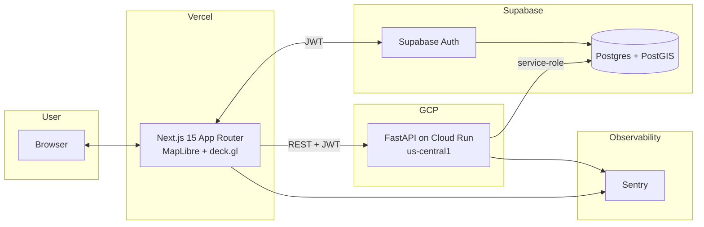

# WatchDawg

> OSINT maritime security dashboard for the Red Sea and Horn of Africa.


**Classification:** UNCLASSIFIED // OSINT

> Phase 1 status: infrastructure only. The map is empty because the data
> doesn't exist yet. Data ingestion lands in Phase 2.

## Live demo

- Web: _(pending first Vercel deploy)_
- API: _(pending first Cloud Run deploy)_

## The problem

Maritime traffic through Bab el-Mandeb carries ~12% of global seaborne trade
and has been repeatedly disrupted since 2023. Open-source signals about
incidents, AIS anomalies, and narrative shifts arrive faster than most
commercial feeds and are free if you know where to look — but they're
scattered across a dozen APIs with incompatible licenses and update cadences.
WatchDawg fuses them into one dashboard with honest provenance.

## Who this is for

- **Maritime insurance underwriters** pricing war-risk premia.
- **NGO humanitarian planners** routing logistics through the Gulf of Aden
  and Red Sea corridor.

This is not a military targeting tool. It surfaces public information with
clear source attribution.

## What it does (as of Phase 1)

- Authenticated dashboard shell (email/password + magic link via Supabase)
- MapLibre + deck.gl map centered on the Red Sea focus region
- Health-probed backend status pill (LIVE / DEGRADED / OFFLINE)
- Hardened CORS, security headers, and RLS from row zero
- CI + WIF-based deploy pipeline

## Architecture



Each edge is explained in [docs/ARCHITECTURE.md](docs/ARCHITECTURE.md).

## Tech stack

| Layer       | Choice                                    | Why not the alternative                                      |
| ----------- | ----------------------------------------- | ------------------------------------------------------------ |
| Frontend    | Next.js 15 App Router, TypeScript strict  | Remix is solid; Next has better Vercel integration + RSC     |
| Map         | MapLibre GL + deck.gl                     | Mapbox GL requires a token; Leaflet lacks GPU layer rendering |
| UI          | Tailwind + shadcn/ui                      | MUI is visually too rounded / consumer for defense aesthetic |
| Backend     | FastAPI (Python 3.12) + pydantic v2       | Express wastes Python's ML ecosystem in Phase 4              |
| DB          | Supabase (Postgres + PostGIS)             | Firestore can't do spatial joins; Railway has no free tier   |
| Auth        | Supabase Auth                             | Clerk is paid; Auth0 is overkill                             |
| Scheduler   | GitHub Actions cron                       | Cloud Scheduler costs; GH Actions free on public repos       |
| CI/CD       | GH Actions → Cloud Run via WIF            | Long-lived SA JSON keys in `GITHUB_SECRETS` are a liability  |
| Observability | Sentry                                  | Datadog is $15/host/mo; Sentry free tier is sufficient       |

## Data sources

| Source      | License           | Attribution       | Status   |
| ----------- | ----------------- | ----------------- | -------- |
| GDELT 2.1   | Public domain     | Required in UI    | Phase 2  |
| AISStream   | MIT (feed is CC0) | Required in UI    | Phase 2  |
| OpenSky     | CC BY 4.0         | Required in UI    | Phase 2  |
| NewsData.io | Commercial (free tier) | Required in UI | Phase 2  |
| Reddit      | Reddit API ToS    | Required in UI    | Phase 2  |

### Sources we chose NOT to use

| Source      | Why not                                                                |
| ----------- | ---------------------------------------------------------------------- |
| ACLED       | Non-commercial academic license incompatible with public portfolio use |
| NewsAPI.org | "Developer" tier forbids production deployment                         |

## Local development

```bash
pnpm install
pnpm -C apps/web dev          # http://localhost:3000

cd apps/api
uv sync
uv run uvicorn watchdawg_api.main:app --reload   # http://localhost:8000
```

See [CONTRIBUTING.md](CONTRIBUTING.md) for the full workflow.

## Deployment

- **Frontend** deploys to Vercel from `main` (root `apps/web`).
- **Backend** deploys to Cloud Run via GitHub Actions with Workload
  Identity Federation — no long-lived service-account keys.
- **Database** migrations apply via the Supabase CLI.

Reproducible GCP setup: [infra/gcp/WIF_SETUP.md](infra/gcp/WIF_SETUP.md).

## Methods and limitations

_Filled in Phase 5._ Will cover event-extraction precision/recall, fusion
scoring, uncertainty propagation, and known coverage gaps.

## Tradecraft

_Filled in Phase 7._ Will map the product to the Admiralty Code for source
reliability, ICD 203 for analytic rigor, and F3EAD for workflow framing.

## What this is NOT

- A targeting system. No military coordinates, no kinetic recommendations.
- A classified product. Classification is UNCLASSIFIED // OSINT.
- A real-time C2 tool. Ingestion cadences are minutes, not milliseconds.
- A replacement for commercial risk data. It is complementary OSINT.

## Roadmap

1. **Phase 1** — Infrastructure, auth, empty map (← you are here).
2. **Phase 2** — Data ingestion (GDELT, AIS, OpenSky, NewsData, Reddit).
3. **Phase 3** — Interactive map layers, timeline, detail panels.
4. **Phase 4** — Fusion + scoring + ML anomaly detection.
5. **Phase 5** — Methodology documentation and evaluation harness.
6. **Phase 6** — Alerting and saved views.
7. **Phase 7** — Tradecraft write-up, Lighthouse CI, polish.

## Acknowledgments

Per data-source license requirements; full attribution renders in the UI
when those layers land (Phase 2+).

## License

[MIT](LICENSE).
