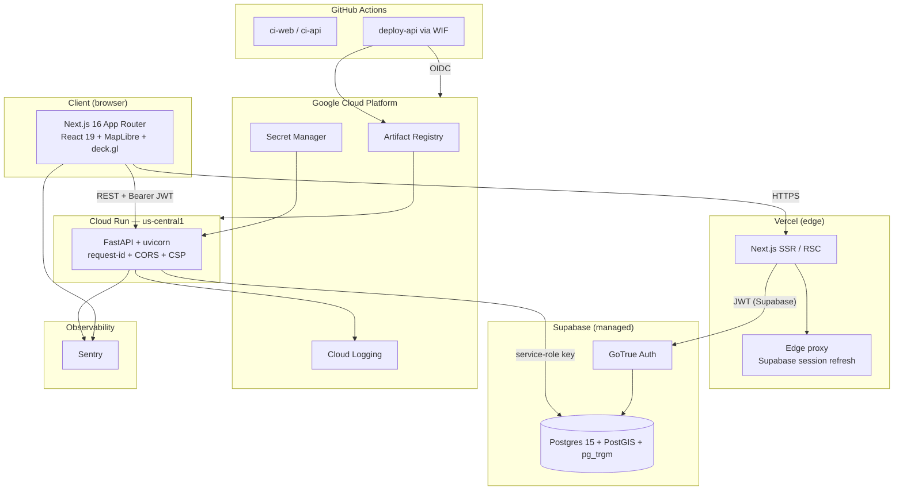

# WatchDawg architecture

**Classification:** UNCLASSIFIED // OSINT

This document describes the Phase 1 state of the system. Later phases add
ingestion workers, fusion pipelines, and ML models, each of which amends
this diagram.

## System diagram



## Edges explained

- **UI ⇄ SSR.** The browser speaks HTTPS to Vercel; all React Server
  Components render there, not in the browser.
- **SSR → GoTrue.** Session refresh and JWT validation happen via the
  `@supabase/ssr` helpers. The middleware on every request keeps the
  session cookie fresh; the dashboard layout calls `supabase.auth.getUser()`
  (which hits GoTrue) — not `getSession()` (which only reads the cookie).
- **UI → API.** The browser calls FastAPI directly with the Supabase
  access token as a `Bearer` header. The backend validates the JWT using
  the Supabase JWKS. No cookie crosses to the API — CORS credentials
  are disabled to reduce CSRF surface.
- **API → Postgres.** The API uses the Supabase service-role key exclusively
  and performs its own authorization logic in Python. RLS on `profiles`
  still enforces correct behavior under the anon key, which we only ever
  expose to the browser for direct Supabase Auth calls.
- **GoTrue → Postgres.** Internal to Supabase; GoTrue owns `auth.users`,
  triggers mirror rows into `public.profiles`.
- **Deploy → GCP.** GitHub Actions exchanges its OIDC token for short-lived
  Google credentials via Workload Identity Federation. No JSON key ever
  touches `GITHUB_SECRETS`.
- **Secret Manager → API.** Secrets reach the Cloud Run revision via
  `--set-secrets` at deploy time. The container never reads a `.env` file.
- **API → Cloud Logging.** structlog writes JSON to stdout; Cloud Run
  forwards to Cloud Logging automatically, preserving `request_id`.
- **UI + API → Sentry.** Errors on either side flow to Sentry. Initialization
  is safe when `SENTRY_DSN` is unset (local development no-ops).

## Why this shape

Every later phase adds workers and data, not infrastructure. By doing the
painful auth + CORS + WIF + RLS wiring in Phase 1, we remove the single
most common cause of portfolio-project failure: infrastructure debt that
compounds as data lands.

## Focus region

All spatial queries in later phases are clipped to:

```
lat_min = 10.0    lat_max = 30.0
lon_min = 32.0    lon_max = 55.0
```

This bounding box covers the Red Sea, Bab el-Mandeb, Gulf of Aden, Arabian
Sea approaches, and the Yemen / Somalia / Djibouti / Eritrea / Saudi /
Egyptian coastlines.
